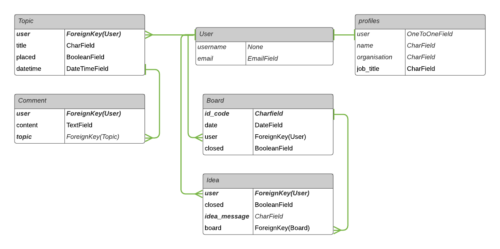
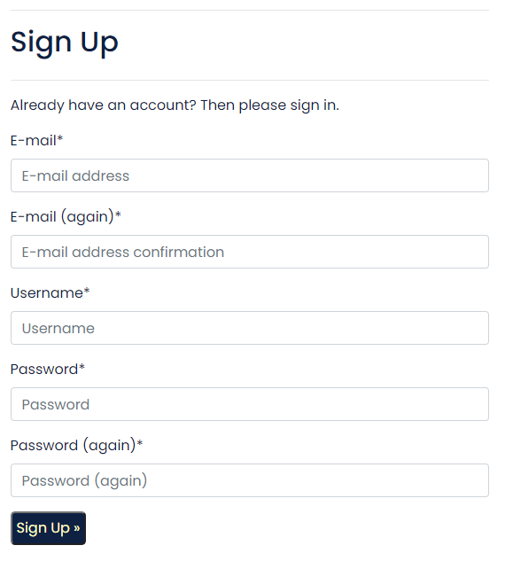
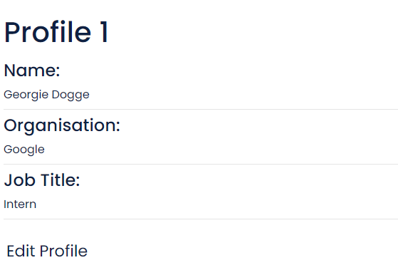
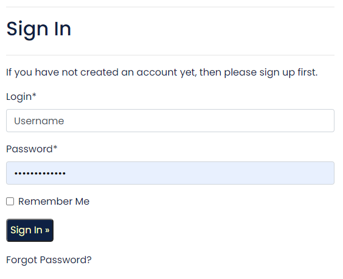
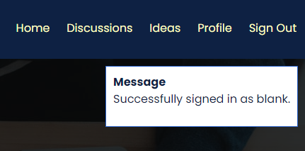
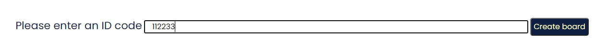
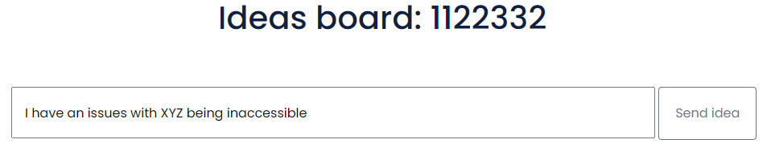
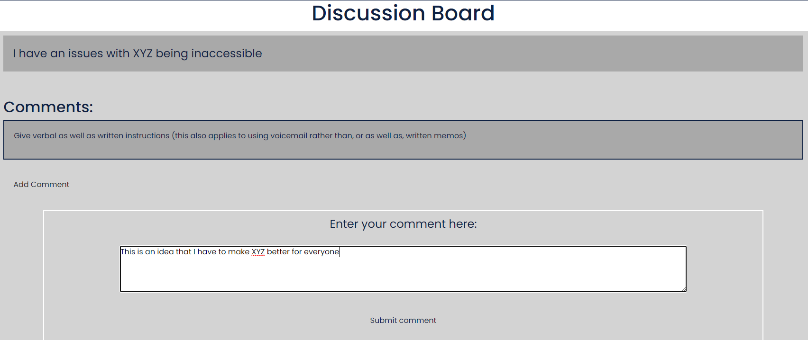
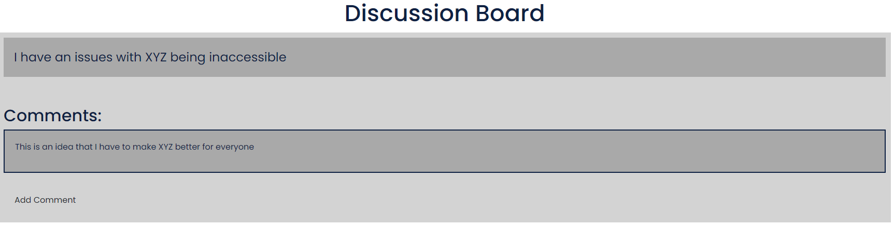

SafeSpaceSODAPlace is a user based discussion board where people can discuss accessibilty issues that they may be facing in the work place. All discussions and user inputs are anonymous which gives people peace of mind. 

Users will be able to draw attention to their own needs that may not be being met in the work place without having to directly disclose any hidden disabilities that they woud rather keep private. 

You can find the live site [here](https://safe-space-soda-place.herokuapp.com/).

## Wireframes
[Click here for the desktop wireframe](static/img/readme/full-wireframes.png)

## Flow

## Features
- Nav bar that updates depending on user authentication
   - If User not logged in:

   - If user logged in:

- User can register an account

- User can add, edit and view profile information

- User can Log in & Log out

- Messages displayed to update user on any actions happening

- User can create a dicussion board

- User can submit an idea to be discussed

- User can add coments to a discussion

## Testing

## Technologies Used

## Contributors

- [Matt Cooper](https://github.com/YesCoops)
- [Steven Dawson](https://github.com/Steven-Dawson18)
- [Django Heimgartner](https://github.com/D1ang)
- [Daisy McGirr](https://github.com/Daisy-McG)
- [Amy O'Shea](https://github.com/AmyOShea)
